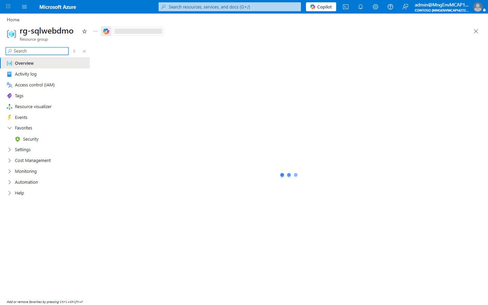
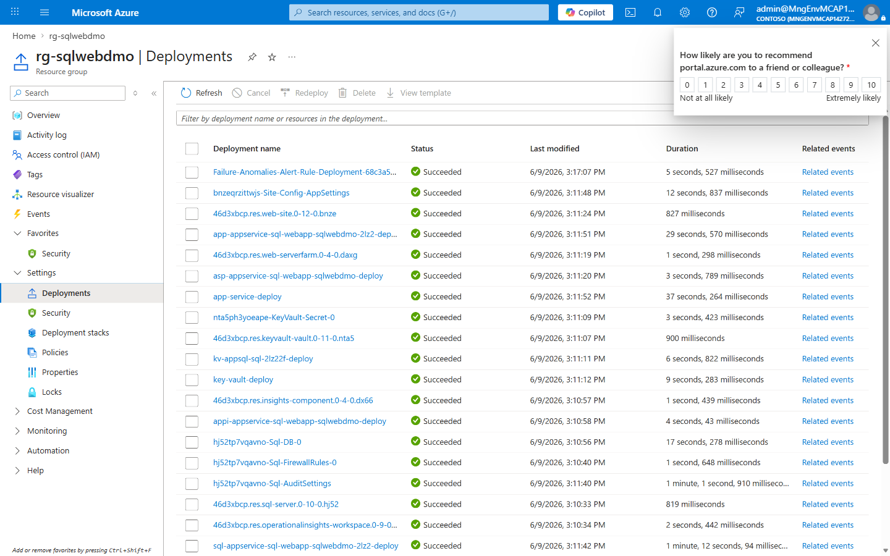
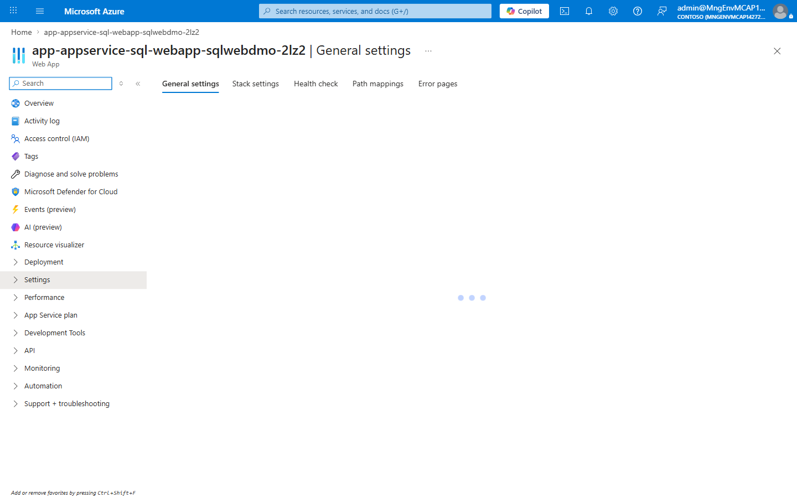
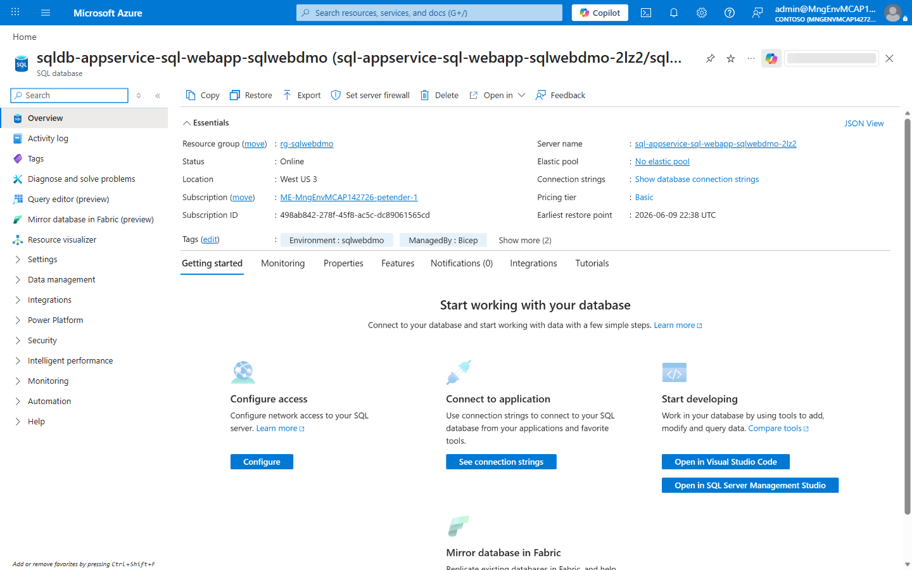
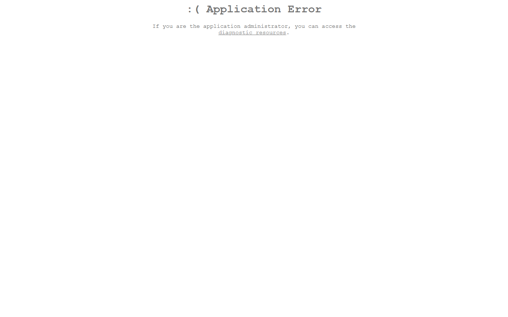

# Demo Guide - appservice-sql-webapp

📑 Demo Guide Contents

---

### appservice-sql-webapp - demo scenario

**Note:** Below demo steps should be used **as a guideline** for doing your own demos.

---

### 1. What Resources are getting deployed

This scenario deploys a logistics web app on App Service with Azure SQL backend.
It demonstrates PaaS hosting, managed database operations, and monitoring.

- rg-sqlwebdmo - Azure Resource Group.
- app-appservice-sql-webapp-sqlwebdmo-2lz2 - App Service.
- asp-appservice-sql-webapp-sqlwebdmo - App Service Plan.
- sql-appservice-sql-webapp-sqlwebdmo-2lz2 and sqldb-appservice-sql-webapp-sqlwebdmo.
- kv-appsql-sql-2lz22f - Key Vault.
- log-appservice-sql-webapp-sqlwebdmo and appi-appservice-sql-webapp-sqlwebdmo.

  

  

  

  

### 2. What can I demo from this scenario after deployment

Pre-demo checklist:

- PASS: `az group show --name rg-sqlwebdmo --output table`
- PASS: `az webapp show --name app-appservice-sql-webapp-sqlwebdmo-2lz2 --resource-group rg-sqlwebdmo --query state -o tsv`
- PASS: `az sql db show --name sqldb-appservice-sql-webapp-sqlwebdmo --server sql-appservice-sql-webapp-sqlwebdmo-2lz2 --resource-group rg-sqlwebdmo --query status -o tsv`

Demo flow (Technical, 30 minutes):

1. (4 min) Review resource group and architecture context.
2. (5 min) Show App Service settings and deployment state.
3. (5 min) Show SQL server/database and discuss data model.
4. (6 min) Open web app and walk through logistics CRUD pages.
5. (5 min) Show Key Vault integration and managed identity access pattern.
6. (5 min) Show App Insights telemetry and dependency traces.

Live URL:

- https://app-appservice-sql-webapp-sqlwebdmo-2lz2.azurewebsites.net

Contingency playbook:

- Web app warm-up delay:
  - Diagnose: app status and logs from App Service.
  - Recover: `az webapp restart -n app-appservice-sql-webapp-sqlwebdmo-2lz2 -g rg-sqlwebdmo`
- SQL throttling:
  - Diagnose: DTU and query metrics in SQL portal blade.
  - Recover: temporarily scale SKU for demo window.
- Secret resolution failure:
  - Diagnose: Key Vault reference and MI role assignments.
  - Recover: reapply role assignment and restart app.

  

---

